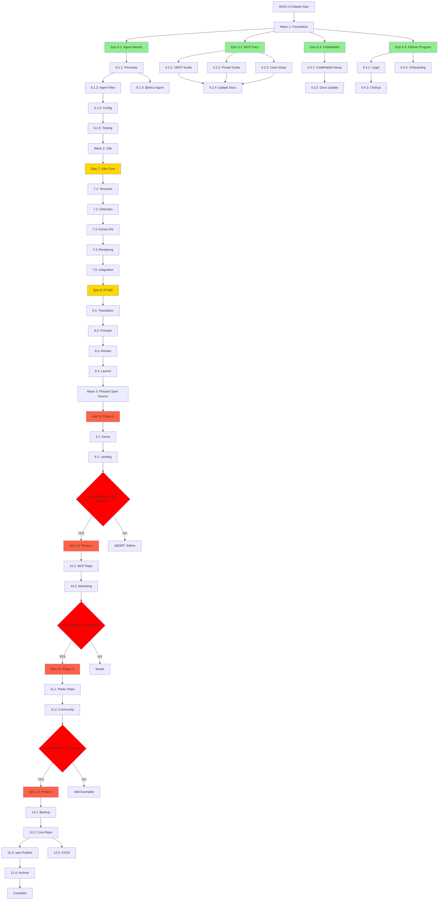

# AIOS 2.0 Story Dependencies

**Generated:** 2025-11-14

## 🔗 Dependency Analysis

This document maps all dependencies between the 36 stories to identify:
- Critical path (longest sequential chain)
- Blocking relationships
- Parallel execution opportunities

---

## 📊 Dependency Diagram



---

## 🎯 Critical Path Analysis

The **critical path** is the longest sequence of dependent stories that determines minimum project duration.

### Critical Path (16.6 weeks parallel, 21.5 weeks sequential)

```
6.1.1 (2d) → 6.1.2 (3d) → 6.1.4 (2d) → 6.1.5 (2d) → 
7.1 (1d) → 7.2 (2d) → 7.3 (3d) → 7.4 (2d) → 7.5 (2d) → 
8.1 (2w) → 8.2 (1w) → 8.3 (1w) → 8.4 (3d) → 
9.1 (0.5d) → 9.2 (0.25d) → [validation] → 
10.1 (2d) → 10.2 (3d) → [validation] → 
11.1 (3d) → 11.2 (2d) → [validation] → 
12.1 (1w) → 12.2 (2w) → 12.3 (1w) → 12.4 (1w)
```

**Bottlenecks:**
- Story 6.1.3 (@docs Agent) is 3 weeks but doesn't block other stories after 6.1.1
- Epic 7 → Epic 8 dependency forces sequential execution (6 weeks)
- Wave 3 validation gates force sequential epics (8 weeks)

---

## 📋 Dependency Matrix

| Story | Prerequisites | Blocks | Can Parallelize With |
|-------|--------------|--------|---------------------|
| 6.1.1 | None | 6.1.2, 6.1.3 | 6.2.*, 6.3.*, 6.4.* |
| 6.1.2 | 6.1.1 | 6.1.4 | 6.1.3, 6.2.*, 6.3.*, 6.4.* |
| 6.1.3 | 6.1.1 | None | 6.1.2-6.1.5, 6.2.*, 6.3.*, 6.4.* |

*Matrix abbreviated for brevity. Full matrix available in stories-data.json.*

---

**Last Updated:** 2025-11-14
