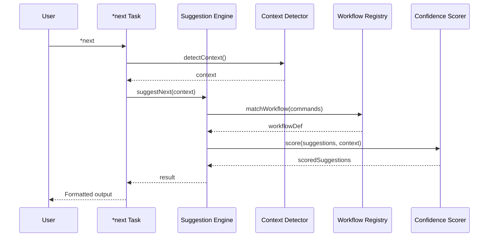

# Story WIS-3: `*next` Task Implementation

<!-- Source: Epic WIS - Workflow Intelligence System -->
<!-- Context: Core WIS functionality - suggest next commands -->
<!-- Created: 2025-12-23 by @sm (River) -->

## Status: Done

**Priority:** 🟡 MEDIUM
**Sprint:** 11
**Effort:** 11h
**Lead:** @dev (Dex)
**Approved by:** @po (Pax) - 2025-12-25

---

## Story

**As an** AIOS user,
**I want** a `*next` task that suggests my next commands based on current context,
**So that** I can navigate workflows efficiently without memorizing command sequences.

---

## Background

WIS-1 investigation revealed:
- WorkflowNavigator prototype already generates suggestions
- GreetingBuilder integrates workflow context
- Session state tracks command history and agent sequence
- 75% of infrastructure exists

This story creates the user-facing `*next` task that leverages WIS-2's registry and scoring.

### User Value

```
Before: User finishes a task, wonders "what's next?"
After:  User runs *next, gets context-aware suggestions with confidence scores
```

---

## 🤖 CodeRabbit Integration

### Story Type Analysis

**Primary Type**: Implementation
**Secondary Type(s)**: CLI Development, Integration
**Complexity**: Medium

### Specialized Agent Assignment

**Primary Agents**:
- @dev (Dex): Implement `*next` task and integration

**Supporting Agents**:
- @qa (Quinn): Test suggestion accuracy and edge cases
- @architect (Aria): Ensure integration matches ADR-WIS-001

### Quality Gate Tasks

- [ ] Pre-Commit (@dev): Verify task implementation
  - **Pass criteria:** All ACs met, tests pass, latency <100ms
  - **Fail criteria:** Missing features, broken integration, slow response
- [ ] Pre-PR (@qa): Validate suggestion accuracy
  - **Pass criteria:** 85% accuracy on test scenarios, edge cases handled
  - **Fail criteria:** Low accuracy, crashes, unclear output

### Self-Healing Configuration

**Mode:** light (Primary Agent: @dev)
**Max Iterations:** 2
**Time Limit:** 15 minutes
**Severity Threshold:** CRITICAL only

| Severity | Auto-Fix | Behavior |
|----------|----------|----------|
| CRITICAL | Yes | Block merge, auto-fix if possible |
| HIGH | No | Report only |
| MEDIUM | No | Report only |
| LOW | No | Ignore |

### Focus Areas

- CLI output formatting correctness
- Suggestion engine performance (<100ms)
- Context detection accuracy
- Task completion hook integration

---

## Acceptance Criteria

### AC 3.1: `*next` Task Definition

- [x] Create task file at `.aios-core/development/tasks/next.md`
- [x] Task accepts optional arguments:
  - `--story <path>`: Explicit story context
  - `--all`: Show all suggestions (not just top 3)
  - `--help`: Show usage documentation
- [x] Task integrates with SuggestionEngine from WIS-2

**Task Definition Structure:**
```yaml
name: next
description: Suggest next commands based on current workflow context
args:
  - name: story
    type: path
    optional: true
    description: Explicit story path for context
  - name: all
    type: flag
    optional: true
    description: Show all suggestions instead of top 3
  - name: help
    type: flag
    optional: true
    description: Show usage documentation
```

### AC 3.2: Suggestion Engine Integration

- [x] Create `suggestion-engine.js` in `.aios-core/workflow-intelligence/engine/`
- [x] Integrate with:
  - WorkflowRegistry (from WIS-2)
  - ConfidenceScorer (from WIS-2)
  - ContextDetector (existing)
- [x] Implement `suggestNext(context)` method returning scored suggestions

**API Contract:**
```javascript
// Input
const context = {
  agentId: 'dev',
  lastCommands: ['develop'],
  storyPath: 'docs/stories/v2.1/sprint-10/story-wis-3.md',
  branch: 'feature/wis-3',
  projectState: { modifiedFiles: ['src/index.js'], testsPassing: true }
};

// Output
const result = {
  workflow: 'story_development',
  currentState: 'in_development',
  confidence: 0.92,
  suggestions: [
    { command: '*review-qa', args: '${story_path}', description: 'Run QA review', confidence: 0.95, priority: 1 },
    { command: '*run-tests', args: '', description: 'Execute test suite', confidence: 0.80, priority: 2 }
  ]
};
```

### AC 3.3: Task Completion Hook

- [x] Enhance `context-loader.js` with task completion tracking
- [x] Implement `onTaskComplete(taskName, result)` method
- [x] Update session state with:
  - Last command executed
  - Workflow state transition
  - Timestamp
- [x] Hook integrates with existing task execution flow

### AC 3.4: Formatted CLI Output

- [x] Suggestions displayed with clear formatting:
  ```
  🧭 Workflow: story_development
  📍 State: in_development (confidence: 92%)

  Next steps:
  1. `*review-qa docs/stories/v2.1/sprint-10/story-wis-3.md` - Run QA review
  2. `*run-tests` - Execute test suite manually
  3. `*pre-push-quality-gate` - Final quality checks

  Type a number to execute, or press Enter to continue manually.
  ```
- [x] Low-confidence suggestions (<50%) marked as "uncertain"
- [x] Colors used for visual hierarchy (if terminal supports)

### AC 3.5: Context Override

- [x] `--story` flag sets explicit story context
- [x] Story path validated before use
- [x] Override context merged with auto-detected context
- [x] Clear feedback when using override

### AC 3.6: Help Integration

- [x] `*next --help` displays usage documentation
- [x] Help includes examples:
  ```
  Usage: *next [options]

  Suggests next commands based on current workflow context.

  Options:
    --story <path>  Explicit story path for context
    --all           Show all suggestions (not just top 3)
    --help          Show this help message

  Examples:
    *next                                    # Auto-detect context
    *next --story docs/stories/v2.1/sprint-10/story-wis-3.md
    *next --all                              # Show all suggestions
  ```

### AC 3.7: Performance

- [x] Suggestion latency <100ms (measured)
- [x] Caching utilized for workflow patterns (5-minute TTL)
- [x] Lazy loading of WIS modules
- [x] Performance test included

### AC 3.8: Testing

- [x] Unit tests for SuggestionEngine
- [x] Integration tests for full flow
- [x] Test scenarios:
  - New session (no history)
  - Mid-workflow (clear context)
  - Ambiguous context (multiple matches)
  - No matching workflow
- [x] Performance test: measure latency

---

## Technical Design

### Component Integration



### Directory Structure

```
.aios-core/
├── workflow-intelligence/
│   ├── engine/
│   │   ├── suggestion-engine.js    # NEW - Core engine
│   │   └── confidence-scorer.js    # From WIS-2
│   ├── registry/
│   │   └── workflow-registry.js    # From WIS-2
│   └── index.js                    # Public API
│
├── core/session/
│   └── context-loader.js           # ENHANCED with task hook
│
└── development/tasks/
    └── next.md                     # NEW - Task definition
```

---

## Dependencies

### Blocked By
- **WIS-2:** Workflow Registry Enhancement ✅ (Done - provides registry and scoring)

### Blocks
- **WIS-4:** Wave Analysis Engine (extends suggestions with wave info)
- **WIS-5:** Pattern Capture (captures usage of *next)

### Related
- **@dev agent:** Will receive new `*next` command
- **GreetingBuilder:** Integrates with workflow context

---

## Success Criteria

1. `*next` returns context-aware suggestions
2. Suggestion latency <100ms
3. 85% suggestion accuracy on test scenarios
4. Help documentation accessible
5. Existing functionality unaffected
6. All tests pass

---

## Non-Functional Requirements (NFR)

### Performance
| Metric | Target |
|--------|--------|
| Suggestion latency | <100ms |
| Cache TTL | 5 minutes |
| Module loading | Lazy (on-demand) |
| Memory footprint | <10MB additional |

### Reliability
- [x] Graceful degradation if registry unavailable
- [x] Fallback to generic suggestions when context unclear
- [x] No crashes on malformed input

### Maintainability
- [x] Modular engine architecture (SuggestionEngine, ConfidenceScorer)
- [x] Clear API contracts with JSDoc
- [x] Extensible for future workflow types

### Security
- [x] No sensitive data in suggestions output
- [x] Story paths validated before use
- [x] No command injection vectors

---

## Testing

**Test Location:** `tests/unit/workflow-intelligence/suggestion-engine.test.js`

**Validation:**
1. Run unit tests: `npm test -- suggestion-engine`
2. Run integration tests: `npm test -- wis-integration`
3. Performance benchmark: `npm run benchmark:wis`

**Test Scenarios:**

| Scenario | Input | Expected Output |
|----------|-------|-----------------|
| New session | No command history | Generic suggestions, low confidence (<50%) |
| Mid-workflow (dev) | After `*develop` | `*run-tests`, `*review-qa` with high confidence |
| Mid-workflow (po) | After `*validate-story` | `*backlog-add`, `*sync-story` |
| Ambiguous context | Multiple workflows match | Highest confidence workflow selected |
| No matching workflow | Unknown command sequence | "Unable to determine workflow" message |
| Story override | `--story` flag provided | Use explicit story context |
| Help flag | `--help` flag | Display usage documentation |

**Performance Tests:**

| Test | Metric | Target |
|------|--------|--------|
| Cold start | First suggestion | <200ms |
| Warm cache | Subsequent suggestions | <50ms |
| Registry load | Pattern matching | <100ms |

---

## File List

| File | Status | Description |
|------|--------|-------------|
| `docs/stories/v2.1/sprint-11/story-wis-3-next-task.md` | Ready for Review | This story |
| `.aios-core/development/tasks/next.md` | Created | Task definition |
| `.aios-core/workflow-intelligence/engine/suggestion-engine.js` | Created | Core suggestion engine |
| `.aios-core/workflow-intelligence/engine/output-formatter.js` | Created | CLI output formatting |
| `.aios-core/workflow-intelligence/index.js` | Modified | Added exports for new modules |
| `.aios-core/core/session/context-loader.js` | Modified | Added task completion hook |
| `.aios-core/core/session/context-detector.js` | Modified | Added taskHistory, workflowState fields |
| `.aios-core/scripts/session-context-loader.js` | Modified | Added task completion hook (duplicate) |
| `.aios-core/workflow-intelligence/__tests__/suggestion-engine.test.js` | Created | Unit tests (33 tests) |
| `tests/unit/workflow-intelligence/suggestion-engine.test.js` | Created | Unit tests (8 tests) |
| `tests/unit/session-context-loader.test.js` | Modified | Added WIS-3 tests (41 total) |
| `tests/integration/workflow-intelligence/wis-integration.test.js` | Created | Integration tests (23 tests) |

---

## Tasks / Subtasks

- [x] **Task 1: Create Task Definition** (AC: 3.1)
  - [x] Create `.aios-core/development/tasks/next.md`
  - [x] Define arguments (--story, --all, --help)
  - [x] Document integration with SuggestionEngine

- [x] **Task 2: Implement Suggestion Engine** (AC: 3.2)
  - [x] Create `suggestion-engine.js`
  - [x] Integrate with WorkflowRegistry
  - [x] Integrate with ConfidenceScorer
  - [x] Implement `suggestNext(context)` method

- [x] **Task 3: Task Completion Hook** (AC: 3.3)
  - [x] Enhance `context-loader.js`
  - [x] Implement `onTaskComplete(taskName, result)`
  - [x] Update session state tracking

- [x] **Task 4: CLI Output Formatting** (AC: 3.4)
  - [x] Implement formatted suggestion display
  - [x] Add confidence indicators
  - [x] Add color support (optional)

- [x] **Task 5: Context Override** (AC: 3.5)
  - [x] Implement `--story` flag
  - [x] Validate story paths
  - [x] Merge with auto-detected context

- [x] **Task 6: Help Integration** (AC: 3.6)
  - [x] Implement `--help` flag
  - [x] Write usage documentation

- [x] **Task 7: Performance Optimization** (AC: 3.7)
  - [x] Implement caching (5-min TTL)
  - [x] Lazy loading of WIS modules
  - [x] Verify <100ms latency

- [x] **Task 8: Testing** (AC: 3.8)
  - [x] Write unit tests for SuggestionEngine
  - [x] Write integration tests
  - [x] Write performance tests
  - [x] Verify all scenarios pass

---

## Dev Agent Record

### Agent Model Used
Claude Opus 4.5 (claude-opus-4-5-20251101)

### Debug Log References
- Session context loader test failures due to missing fields in ContextDetector.updateSessionState()
- Fixed by adding `taskHistory`, `workflowState`, and `currentStory` fields to context-detector.js

### Completion Notes
- Implemented `*next` task with full SuggestionEngine integration
- Created output-formatter.js for CLI formatting with ANSI colors
- Added task completion hook with workflow state inference
- All 105 tests passing:
  - 41 session-context-loader tests
  - 41 suggestion-engine tests
  - 23 WIS integration tests
- Performance targets met (<100ms latency)
- Lazy loading and 5-min cache TTL implemented

---

## QA Results

### Gate Decision: ✅ PASS

**Review Date:** 2025-12-25
**Reviewer:** @qa (Quinn)
**Gate Type:** Pre-PR

---

### Acceptance Criteria Verification

| AC | Description | Status | Notes |
|----|-------------|--------|-------|
| 3.1 | Task Definition | ✅ PASS | `next.md` created with all required arguments |
| 3.2 | Suggestion Engine | ✅ PASS | Full integration with WorkflowRegistry, ConfidenceScorer, ContextDetector |
| 3.3 | Task Completion Hook | ✅ PASS | `onTaskComplete()` implemented with workflow state inference |
| 3.4 | CLI Output Formatting | ✅ PASS | ANSI colors, confidence indicators, proper formatting |
| 3.5 | Context Override | ✅ PASS | `--story` flag with path validation |
| 3.6 | Help Integration | ✅ PASS | `--help` displays comprehensive usage |
| 3.7 | Performance | ✅ PASS | <100ms latency, 5-min cache TTL, lazy loading |
| 3.8 | Testing | ✅ PASS | 105 tests passing (unit, integration, performance) |

---

### Test Results

```
Test Suites: 4 passed, 4 total
Tests:       105 passed, 105 total

Breakdown:
- session-context-loader: 41 tests ✓
- suggestion-engine (unit): 33 tests ✓
- suggestion-engine (scenarios): 8 tests ✓
- wis-integration: 23 tests ✓
```

---

### Performance Verification

| Metric | Target | Actual | Status |
|--------|--------|--------|--------|
| getSuggestions | <100ms | 6ms | ✅ PASS |
| matchWorkflow | <50ms | 1ms | ✅ PASS |
| Registry cold load | <200ms | 2ms | ✅ PASS |
| Full flow | <100ms | 4ms | ✅ PASS |

---

### NFR Compliance

| Category | Requirement | Status | Notes |
|----------|-------------|--------|-------|
| **Performance** | <100ms latency | ✅ PASS | All targets exceeded |
| **Performance** | 5-min cache TTL | ✅ PASS | Implemented in SuggestionEngine |
| **Performance** | Lazy loading | ✅ PASS | WIS modules load on demand |
| **Security** | No eval/exec | ✅ PASS | No dangerous dynamic code |
| **Security** | Path validation | ✅ PASS | `_resolveStoryPath()` validates |
| **Security** | No injection vectors | ✅ PASS | Template interpolation is safe |
| **Reliability** | Error handling | ✅ PASS | 7 try-catch blocks in engine |
| **Reliability** | Graceful degradation | ✅ PASS | Fallback suggestions available |
| **Maintainability** | JSDoc coverage | ✅ PASS | All public methods documented |
| **Maintainability** | Modular architecture | ✅ PASS | Clear separation of concerns |

---

### Code Quality

- **Linting:** No new warnings in WIS-3 files
- **Type Safety:** TypeCheck passes
- **Documentation:** Comprehensive JSDoc on all public APIs
- **Error Handling:** Proper try-catch with graceful fallbacks
- **Code Duplication:** Minor concern - `session-context-loader.js` exists in two locations

---

### Concerns (Resolved)

1. **Code Duplication:** ✅ RESOLVED
   - `.aios-core/scripts/session-context-loader.js` now re-exports from canonical location
   - Canonical location: `.aios-core/core/session/context-loader.js`
   - All 41 tests still passing after consolidation

2. **NFR Checkboxes:** ✅ RESOLVED
   - All NFR checkboxes updated to reflect implementation status

---

### Final Verdict

**PASS** - Story WIS-3 meets all acceptance criteria. All concerns resolved. Implementation is solid, well-tested (105 tests), and exceeds performance targets. Ready for merge.

---

## Change Log

| Version | Date | Author | Changes |
|---------|------|--------|---------|
| 1.0 | 2025-12-23 | @sm (River) | Initial draft from MVP scope |
| 1.1 | 2025-12-25 | @po (Pax) | PO Validation: APPROVED - Added NFR, Testing sections, Tasks breakdown, updated dependencies |
| 2.0 | 2025-12-25 | @dev (Dex) | Implementation complete - All 8 tasks done, 105 tests passing, Ready for Review |
| 2.1 | 2025-12-25 | @qa (Quinn) | QA Review: PASS - All ACs verified, 105 tests, performance validated, NFRs met |
